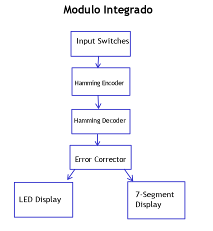
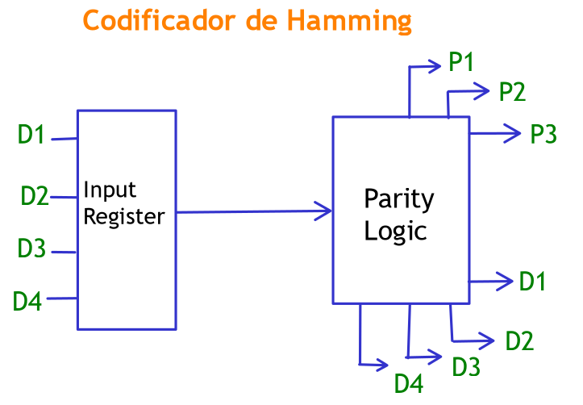
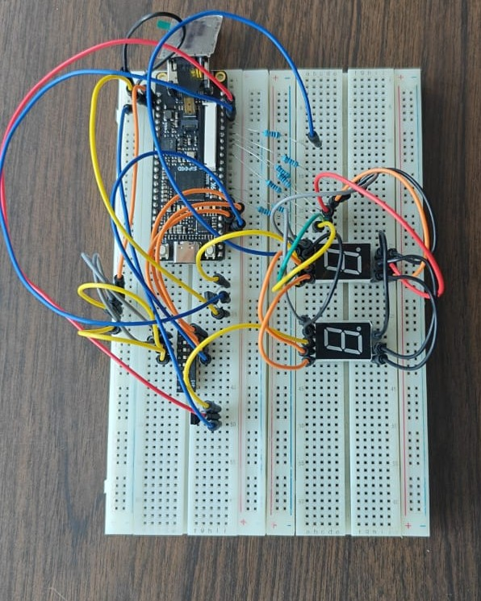
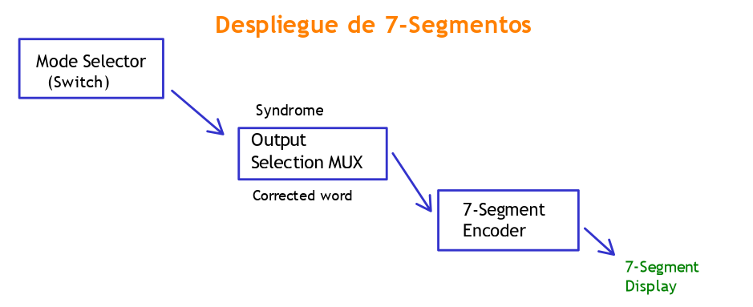
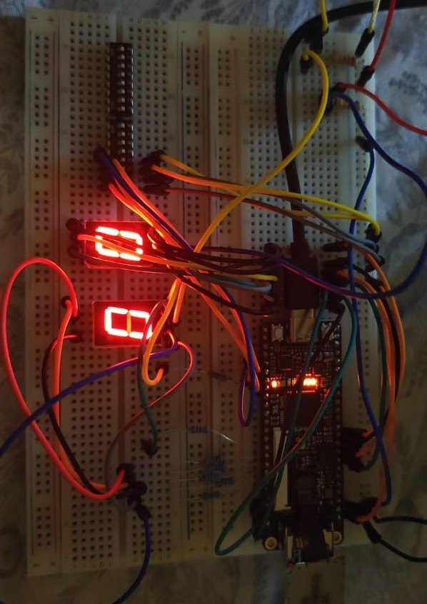

# Sistema de detección y corrección de errores con Hamming (7,4)

## 1. Abreviaturas y definiciones
- **FPGA**: Field Programmable Gate Array  
- **SECDED**: Single Error Correction, Double Error Detection  
- **SB1**: Subsistema de codificación  
- **SB2**: Subsistema de síndrome y corrección  
- **SB3**: Subsistema de despliegue en LEDs  
- **SB4**: Subsistema de despliegue en 7 segmentos  

---

## 2. Resumen
En este documento se explica la implementación de un sistema digital en FPGA que utiliza el **código Hamming (7,4)** para detectar y corregir errores de un solo bit en la transmisión de datos.  

El diseño incluye:  
1. Un **subsistema de codificación** que genera la palabra de 7 bits a partir de 4 bits de datos.  
2. Un **subsistema de detección y corrección**, que calcula el síndrome y corrige el bit erróneo.  
3. Un **subsistema de despliegue en LEDs**, que muestra la palabra corregida.  
4. Un **subsistema de despliegue en 7 segmentos**, que permite visualizar el dato transmitido o la posición del error.  

---

## 3. Introducción
El objetivo del proyecto fue **llevar la teoría del código de Hamming a la práctica** implementando en la FPGA TangNano 9K un sistema capaz de:  
- Detectar y corregir un error de un solo bit.  
- Identificar la posición del error mediante el cálculo del síndrome.  
- Desplegar resultados en salidas visuales (LEDs y displays de 7 segmentos).  

Se usaron testbenches para validar cada subsistema y se sintetizó el diseño completo utilizando **OssCadSuite** junto con **Yosys** y **nextpnr**.  


  

---

## 4. Desarrollo

### 4.1 Descripción general del sistema
El sistema se compone de los siguientes subsistemas:  
- **SB1 – Codificador Hamming**: genera la palabra de 7 bits con paridades.  
- **SB2 – Síndrome y corrector**: identifica la posición del error y lo corrige.  
- **SB3 – LEDs**: despliegan la palabra corregida.  
- **SB4 – Displays 7 segmentos**: muestran la palabra transmitida o la posición del error.  
 

---

### 4.2 Subsistema de codificación
Genera el código Hamming agregando 3 bits de paridad a los 4 bits de datos.  
#### 1. Encabezado del módulo
```SystemVerilog
module hamming_secded_encoder (
    input  logic [3:0] data,
    output logic [7:0] code
);
```

---

### 4.3 Subsistema de síndrome y corrector
Calcula el síndrome, determina si existe un error, corrige el bit afectado y entrega la palabra de 4 bits limpia.  
#### 1. Encabezado del módulo
```SystemVerilog
module hamming_secded_decoder (
    input  logic [7:0] r,
    output logic [3:0] data,
    output logic single_error,
    output logic double_error
);
```

---

### 4.3 Subsistema de LEDs
#### 1. Función
Recibe la palabra corregida y la despliega en los LEDs de la FPGA.  



---

### 4.4 Subsistema de 7 segmentos
#### 1. Función
Muestra en los displays:  
- La palabra transmitida, o  
- La posición del error detectado, en hexadecimal.  

Un switch selecciona cuál información se despliega.  

 

---

## 5. Flujo de herramientas
El flujo de trabajo fue realizado con **VSCode + Lushay + OssCadSuite**.  
Se configuraron tareas en `tasks.json` para automatizar:  

```bash
make sim    # Simulación RTL
make synth  # Síntesis
make pnr    # Place & Route
make pack   # Empaquetado
make prog   # Programación en FPGA
```

 

---

## 6. Resultados
- El sistema corrigió de manera correcta todos los errores de un solo bit.  
- El síndrome coincidió siempre con la posición del error.  
- Cuando no existía error, la salida fue igual a la palabra transmitida.  

 

---

## 7. Conclusiones
- El **código Hamming (7,4)** es confiable para detección y corrección de errores de un bit.  
- La implementación modular en SystemVerilog facilitó la validación y depuración.  
- El flujo de herramientas libres (Yosys + nextpnr) fue suficiente para implementar el proyecto en la TangNano 9K.  
- El trabajo permitió pasar de la teoría a la práctica y comprobar en hardware real la utilidad del diseño.  
